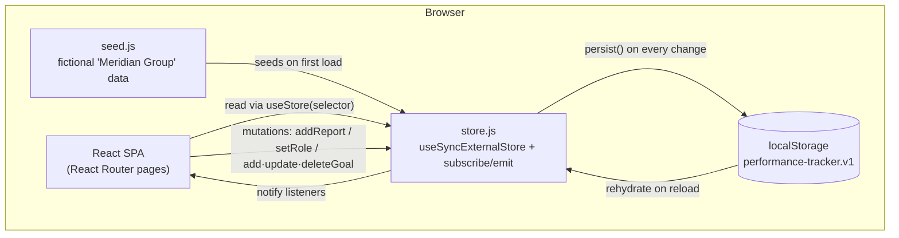

# Enterprise Performance Tracker

> A role-aware KPI & corporate-goals dashboard that gives leadership a single-screen view of enterprise performance — built as a self-contained static React SPA.

[](https://github.com/furqunali/performance-tracker-dashboard/actions/workflows/ci.yml)
[](LICENSE)

**Live demo → https://slp-performance-tracker.vercel.app**

The app ships with fully fictional sample data ("Meridian Group") and runs entirely in the browser — no backend, no sign-in. It is a portfolio demonstration of dashboard UX, data-viz discipline, and pragmatic front-end architecture.

---

## 🧩 Problem

Enterprises track performance across many dimensions at once — corporate goals, departmental KPIs, and business-segment health — and each is owned by a different team and reviewed by a different role. Leadership wants a concise "management review" view; managers need to submit and manage their own KPI reports. Stitching that together usually means a heavyweight app with a database, auth, and role plumbing before a single chart appears.

## 💡 Solution

**Enterprise Performance Tracker** collapses that into one clean, responsive dashboard with role-based views:

- An executive **Dashboard** that rolls corporate goals, departmental KPIs, and segment performance into stat tiles and charts.
- A validated **Submit Report** flow for recording KPI attainment.
- A personal **My Reports** view to review and delete your own submissions.
- A role-gated **Admin Settings** screen for managing corporate goals live.

Because it targets demo/portfolio use, the entire data layer is a client-side store seeded with synthetic data — so the product experience is fully interactive with zero infrastructure to stand up.

## 🏗️ Architecture

Static React single-page app. No backend and no authentication server — persistence is a thin `localStorage`-backed store shim exposed through React's `useSyncExternalStore`, so every component reads from one reactive source of truth.



**How the store works**

- State is seeded from `seed.js` on first load, then rehydrated from `localStorage` (`performance-tracker.v1`) on every subsequent visit.
- All writes go through a small typed API (`addReport`, `deleteReport`, `addCorporateGoal`, `updateCorporateGoal`, `deleteCorporateGoal`, `setRole`, `reset`); each mutation replaces state immutably, persists, and notifies subscribers.
- Reads use `useStore(selector)` so components subscribe only to the slice they need.
- Corrupt or unavailable storage (e.g. private mode) is caught gracefully — the app falls back to in-memory state and keeps working.

**Role gating**

- The current user's `role` (`admin` / `manager`) lives in the store and can be toggled from the top bar via a "View as" switch.
- Navigation filters admin-only routes, and `App.jsx` guards the Admin Settings route directly — a non-admin hitting `/admin-settings` is redirected to the dashboard — so gating is enforced in routing, not just hidden in the menu.

## ✨ Key Features

- **Dashboard** — headline stat tiles (avg attainment, total goals, on-track, at-risk), two composition donut charts (goal status, goals by category), a business-segment bar chart, corporate-goal progress cards, departmental current-vs-target rows, and a recent-reports table.
- **Submit Report** — validated form (KPI name, department, reporting period, attainment %, notes) with inline error messages and range checks.
- **My Reports** — lists reports created by the current user with delete support.
- **Admin Settings** — add corporate goals, adjust attainment live via sliders, delete goals, and reset demo data; gated to the `admin` role.
- **Role switcher** — flip between Admin and Manager in the top bar to explore role-gated views.
- **Responsive & accessibility-minded charts** — mobile-to-desktop layouts, a colorblind-safe categorical palette, and legends plus direct labels so identity is never conveyed by color alone.

## 🛠️ Tech Stack

| Area | Choice |
|------|--------|
| Framework | React 18 + React Router 6 |
| Build tool | Vite 5 |
| Styling | Tailwind CSS 3 (+ PostCSS, Autoprefixer) |
| Charts | Recharts |
| Icons | lucide-react |
| State | `useSyncExternalStore` store shim + `localStorage` |
| Testing | Vitest + React Testing Library + jsdom |
| CI | GitHub Actions (Node 20: test + build) |

## 🧠 Engineering Decisions

- **No backend, by design.** For a portfolio demo the goal is an instantly explorable product, not ops. A `localStorage` store shim delivers full CRUD, persistence across reloads, and a one-click reset — without a database, API, or deploy pipeline beyond a static host. The store is deliberately isolated behind a small API (`store.js`) so a real backend could be dropped in by swapping that one module.
- **`useSyncExternalStore` over a state library.** The app needs a single reactive source of truth shared across routes; React's built-in external-store hook covers that with no extra dependency and no provider tree, while `selector`-based reads keep re-renders scoped.
- **Routing-level role gating.** Rather than only hiding admin UI, the admin route is guarded in `App.jsx` and redirects unauthorized roles — a closer match to how real authorization should behave.
- **Data-viz discipline.** The categorical palette is CVD-safe and validated; the status ramp (on-track / watch / at-risk) is reserved and never reused as a categorical hue, so color always means the same thing across tiles, charts, and badges.
- **Defensive persistence.** Because state is rehydrated from `localStorage`, it is treated as untrusted input: `parseStored` guards against both malformed JSON and structurally invalid blobs (wrong shape / missing collections) and falls back to a clean reseed rather than rendering against half-valid state. Forms validate required fields and clamp numeric ranges before anything reaches the store.
- **Error boundary as a safety net.** A top-level React `ErrorBoundary` wraps the app so an unexpected render error shows a friendly, actionable fallback (with a "reload with fresh data" action) instead of a blank white screen.

## 🧪 Testing & CI

The store shim, role-gating, pure helpers, and rendering are covered by a
[Vitest](https://vitest.dev/) + React Testing Library suite (`src/**/*.test.js{,x}`):

- **Store CRUD & persistence** — add/update/delete goals and reports, role switching, seed reset, and that mutations persist so a reload rehydrates them.
- **Storage resilience** — `parseStored` / `isValidState` reject malformed and structurally invalid JSON.
- **Pure helpers** — `statusFor` thresholds and `segmentColor` palette wrap-around.
- **Role gating** — an admin reaches `/admin-settings`; a manager is redirected and never sees the admin nav link.
- **Rendering** — a Dashboard smoke render and an `ErrorBoundary` fallback test.

```bash
npm test          # vitest run (CI mode)
npm run test:watch
```

Every push and pull request to `main` runs the suite and a production build on
Node 20 via [GitHub Actions](.github/workflows/ci.yml).

## 📊 Results / Demo

**Live: https://slp-performance-tracker.vercel.app**

Open the demo, then use the **"View as"** toggle in the top-right to switch between Admin and Manager and watch the Admin Settings route appear or disappear. Submit a report, see it land in My Reports and the dashboard table, adjust goals from Admin Settings, and use **Reset demo data** to restore the seed.

## 🚀 Setup / Installation

```bash
npm install
npm run dev      # start the dev server (http://localhost:5173)
npm run build    # production build to /dist
npm run preview  # preview the production build
npm test         # run the test suite
```

## 🚢 Deployment

Deploys to any static host. On **Vercel** the defaults work out of the box (build command `npm run build`, output directory `dist`). A [`vercel.json`](vercel.json) adds a SPA rewrite (`/(.*) → /index.html`) so deep links and hard refreshes on client-side routes such as `/admin-settings` resolve to the app instead of a 404. The live deployment is at **https://slp-performance-tracker.vercel.app**.

### Project structure

```
src/
  data/
    seed.js      # fictional sample data (Meridian Group)
    store.js     # client-side store + localStorage persistence (replaces a backend)
  lib/
    theme.js     # validated categorical palette + status helpers
  components/
    Layout.jsx        # top nav, role switcher, footer
    GoalCard.jsx      # progress-ring goal card
    ui.jsx            # shared primitives (Card, StatTile, ProgressBar)
    ErrorBoundary.jsx # top-level render-error fallback
  pages/
    Dashboard.jsx
    SubmitReport.jsx
    MyReports.jsx
    AdminSettings.jsx
  test/
    setup.js          # Vitest setup (jest-dom, ResizeObserver stub)
  App.jsx             # routes + role guard
  main.jsx            # entry
```

Tests live next to the code they cover as `*.test.js` / `*.test.jsx`.

## 🔒 Security & Data

- **No real data.** Every company name, person, email, figure, and KPI is invented ("Meridian Group") for illustration and represents no real organization.
- **No credentials or backend.** There is no login, no API keys, and no server — nothing to leak. All state lives in the visitor's own browser (`localStorage`) and never leaves the device.

## 🗺️ Roadmap

- Pluggable backend adapter behind the existing store API (REST/GraphQL) with real authentication.
- Export dashboard and reports to PDF/CSV.
- Historical trend views per goal (the seed already carries a `trend` series).
- Multi-user reports and per-department filtering.
- Broaden test coverage toward end-to-end (Playwright) flows.

## 🤝 Contributing

Contributions and suggestions are welcome — see [CONTRIBUTING.md](CONTRIBUTING.md)
for the dev workflow, conventions, and PR checklist.

## 📄 License

Released under the [MIT License](LICENSE).
